# 01 - System Architecture

This document outlines the high-level architecture of the autonomous management system. The system is owned by **"SVH Enterprise"** and this specific implementation is for the **"Best PG in Dighi"** brand.

## Core Communication: The Model Context Protocol (MCP) Standard

All components within the system communicate by adhering to the **Model Context Protocol (MCP) standard**. MCP is not a single server, but a secure gateway protocol that defines how Large Language Models (LLMs) can safely and securely interact with a variety of tools, APIs, and data sources.

Our system is architected as a network of MCP-compliant services. Each service exposes a specific set of capabilities (e.g., "billing," "tenant onboarding") that our AI Agents can consume. This approach provides flexibility, security, and clear separation of concerns. The master list of all available capabilities is defined in the `05_MCP_CAPABILITY_REGISTRY.md` document.

## Architecture Diagram

```mermaid
graph TD
    subgraph "Strategic & Legislative"
        CEO(👤 CEO)
        PARLIAMENT(🏛️ Parliament <br> Defines Policies)
    end

    subgraph "Advisory & Oversight (Independent)"
        STRAT(🧠 Strategy & Planning AI)
        AUDIT(🔍 Auditor AI)
        VIGIL(🛡️ Vigilance AI)
        JUD(⚖️ Judiciary AI)
    end

    subgraph "Executive Branch (AI Agents)"
        CAB_SEC(🤖 Cabinet Secretary AI)
        FIN_AGENT(💰 Finance AI Agent)
        SALES_AGENT(📈 Sales AI Agent)
        CARETAKER_AGENT(🛠️ Caretaker AI Agent)
        VERIFICATION_AI(📄 Verification AI)
    end

    subgraph "Interface & Applications"
        PublicWebsite[🌐 Public Website]
        SystemPortal[🔒 Internal System Portal]
        MobileSuite[📱 Native Mobile Suite]
    end

    subgraph "MCP-Compliant Services (The 'Sockets')"
        MCP_AUTH(Auth Service)
        MCP_TENANTS(Tenant Mgmt Service)
        MCP_BILLING(Billing Service)
        MCP_MAINTENANCE(Maintenance Service)
        MCP_LEADS(Lead Gen Service)
        MCP_FINANCE(Financial Ledger Service)
    end

    %% AI to MCP Flows
    CAB_SEC -- "Consumes" --> MCP_AUTH
    CAB_SEC -- "Consumes" --> MCP_TENANTS
    FIN_AGENT -- "Consumes" --> MCP_FINANCE
    FIN_AGENT -- "Consumes" --> MCP_BILLING
    SALES_AGENT -- "Consumes" --> MCP_LEADS
    SALES_AGENT -- "Consumes" --> MCP_TENANTS
    CARETAKER_AGENT -- "Consumes" --> MCP_MAINTENANCE
    CARETAKER_AGENT -- "Consumes" --> MCP_TENANTS

    %% Core Datastore
    DATABASE[(🗄️ Firebase Firestore)]

    MCP_TENANTS -- "Reads/Writes" --> DATABASE
    MCP_FINANCE -- "Reads/Writes" --> DATABASE

    %% App to MCP Flows
    SystemPortal -- "Uses" --> MCP_AUTH
    SystemPortal -- "Uses" --> MCP_TENANTS
    SystemPortal -- "Uses" --> MCP_BILLING
    MobileSuite -- "Uses" --> MCP_AUTH
    MobileSuite -- "Uses" --> MCP_LEADS
    MobileSuite -- "Uses" --> MCP_MAINTENANCE
    PublicWebsite -- "Feeds" --> MCP_LEADS

    %% Oversight Flows
    AUDIT -- "Audits" --> MCP_FINANCE
    AUDIT -- "Audits" --> MCP_BILLING
    VIGIL -- "Monitors" --> MCP_AUTH
    VIGIL -- "Monitors" --> MCP_TENANTS

    %% Human & Policy Flows
    CEO -- "Manages via" --> SystemPortal
    CEO -- "Manages via" --> MobileSuite
    PARLIAMENT -- "Publishes Policies" --> CAB_SEC
```



## Technical Implementation Architecture

This section details the concrete technologies and services chosen to implement the conceptual architecture, with a primary focus on a zero-cost, high-automation model.

```mermaid
graph TD
    subgraph "User Layer"
        USER(👤 User)
    end

    subgraph "Google Cloud Platform (Free Tiers)"
        DNS(🌐 Google Cloud DNS)
        FIREBASE(🔥 Firebase Hosting <br> Free SSL & CDN <br> Routing Rules)
        CLOUDRUN_FE([💻 Cloud Run: Frontend] <br> React/TypeScript)
        CLOUDRUN_BE([🤖 Cloud Run: Backend] <br> Python/FastAPI)
        CLOUDBUILD(🔨 Cloud Build <br> CI/CD Pipeline)
        ARTIFACT(📦 Artifact Registry <br> Docker Image Storage)
    end

    subgraph "Supabase Platform (Free Tier)"
        SUPA_DB[(🗄️ Supabase <br> PostgreSQL Database)]
        SUPA_STORAGE(🗃️ Supabase Storage <br> .apk files)
    end
    
    subgraph "Development & Source Control"
        GITHUB(📁 GitHub Monorepo)
    end

    USER -- "bestpgindighi.in" --> DNS
    DNS --> FIREBASE
    FIREBASE -- "Serves web pages" --> CLOUDRUN_FE
    FIREBASE -- "/api/* rewrite" --> CLOUDRUN_BE
    
    CLOUDRUN_BE -- "Reads/Writes" --> SUPA_DB
    CLOUDRUN_BE -- "Reads/Writes" --> SUPA_STORAGE

    GITHUB -- "On Push" --> CLOUDBUILD
    CLOUDBUILD -- "Builds & Tests" --> GITHUB
    CLOUDBUILD -- "Deploys" --> CLOUDRUN_FE
    CLOUDBUILD -- "Deploys" --> CLOUDRUN_BE
    CLOUDBUILD -- "Stores Image" --> ARTIFACT
    CLOUDBUILD -- "Uploads APK" --> SUPA_STORAGE
```

### **Technology Stack & Rationale**

*   **Entrypoint & Web Hosting:** **Firebase Hosting** will serve as the primary entry point. It provides free, automated SSL certificates, a global CDN for performance, and intelligent routing ("rewrites") to direct traffic to the appropriate backend service, all within its generous free tier. This replaces the need for a paid Load Balancer.
*   **Backend Service:** A **Python** application using the **FastAPI** framework, running on **Google Cloud Run**. This provides a high-performance, scalable, serverless environment that scales to zero, eliminating cost when not in use.
*   **Frontend Service:** A **React** application written in **TypeScript**, also running on **Google Cloud Run**. This provides a modern, secure, and maintainable platform for all web portals.
*   **Database:** A **PostgreSQL** database managed by **Supabase**. This provides a robust, relational database on a perpetual free tier, which is critical for data integrity and cost management.
*   **Mobile Applications:** Native Android applications will be written in **Kotlin**. The UI will be built with **Jetpack Compose**, with a fallback to traditional **XML layouts** if the provided development environment does not support it. Updates will be handled via a custom, mandatory self-update mechanism, with `.apk` files hosted on **Supabase Storage**.
*   **Infrastructure as Code:** The entire cloud infrastructure will be defined as code using **Terraform**. This ensures a repeatable, reliable, and automated setup process.
*   **CI/CD Automation:** **Google Cloud Build** will be triggered on every `git push` to the GitHub repository, automatically testing, building, and deploying all components.

### **Cost-Control & Retention Policies**

The architecture is designed to operate at a near-zero monthly cost.

*   **Primary Recurring Cost:** The only anticipated recurring charge is **~$0.20/month** for **Google Cloud DNS** to keep the domain name active.
*   **Docker Image Optimization:** To remain within the **Google Artifact Registry** free tier (0.5 GB), a multi-stage build process will be used to create minimal, production-only Docker images.
*   **Image Retention Policy:** A strict, automated retention policy will be enforced via Terraform:
    1.  The most recently deployed image will always be tagged `latest` and will be exempt from deletion.
    2.  A maximum of 9 other non-`latest` images will be retained.
    3.  Any non-`latest` image older than 30 days will be automatically deleted.
