# 01 - System Architecture

This document outlines the high-level architecture of the autonomous management system. The system is owned by **"SVH Enterprise"** and this specific implementation is for the **"Best PG in Dighi"** brand.

## Core Communication: The Model Context Protocol (MCP) Standard

All components within the system communicate by adhering to the **Model Context Protocol (MCP) standard**. MCP is not a single server, but a secure gateway protocol that defines how Large Language Models (LLMs) can safely and securely interact with a variety of tools, APIs, and data sources.

Our system is architected as a network of MCP-compliant services. Each service exposes a specific set of capabilities (e.g., "billing," "tenant onboarding") that our AI Agents can consume. This approach provides flexibility, security, and clear separation of concerns. The master list of all available capabilities is defined in the `05_MCP_CAPABILITY_REGISTRY.md` document.

## Architecture Diagram

```mermaid
graph TD
    subgraph "Strategic & Legislative"
        CEO(👤 CEO)
        PARLIAMENT(🏛️ Parliament <br> Defines Policies)
    end

    subgraph "Advisory & Oversight (Independent)"
        STRAT(🧠 Strategy & Planning AI)
        AUDIT(🔍 Auditor AI)
        VIGIL(🛡️ Vigilance AI)
        JUD(⚖️ Judiciary AI)
    end

    subgraph "Executive Branch (AI Agents)"
        CAB_SEC(🤖 Cabinet Secretary AI)
        FIN_AGENT(💰 Finance AI Agent)
        SALES_AGENT(📈 Sales AI Agent)
        CARETAKER_AGENT(🛠️ Caretaker AI Agent)
        VERIFICATION_AI(📄 Verification AI)
    end

    subgraph "Interface & Applications"
        PublicWebsite[🌐 Public Website]
        SystemPortal[🔒 Internal System Portal]
        MobileSuite[📱 Native Mobile Suite]
    end

    subgraph "MCP-Compliant Services (The 'Sockets')"
        MCP_AUTH(Auth Service)
        MCP_TENANTS(Tenant Mgmt Service)
        MCP_BILLING(Billing Service)
        MCP_MAINTENANCE(Maintenance Service)
        MCP_LEADS(Lead Gen Service)
        MCP_FINANCE(Financial Ledger Service)
    end

    %% AI to MCP Flows
    CAB_SEC -- "Consumes" --> MCP_AUTH
    CAB_SEC -- "Consumes" --> MCP_TENANTS
    FIN_AGENT -- "Consumes" --> MCP_FINANCE
    FIN_AGENT -- "Consumes" --> MCP_BILLING
    SALES_AGENT -- "Consumes" --> MCP_LEADS
    SALES_AGENT -- "Consumes" --> MCP_TENANTS
    CARETAKER_AGENT -- "Consumes" --> MCP_MAINTENANCE
    CARETAKER_AGENT -- "Consumes" --> MCP_TENANTS

    %% Core Datastore
    DATABASE[(🗄️ Firebase Firestore)]

    MCP_TENANTS -- "Reads/Writes" --> DATABASE
    MCP_FINANCE -- "Reads/Writes" --> DATABASE

    %% App to MCP Flows
    SystemPortal -- "Uses" --> MCP_AUTH
    SystemPortal -- "Uses" --> MCP_TENANTS
    SystemPortal -- "Uses" --> MCP_BILLING
    MobileSuite -- "Uses" --> MCP_AUTH
    MobileSuite -- "Uses" --> MCP_LEADS
    MobileSuite -- "Uses" --> MCP_MAINTENANCE
    PublicWebsite -- "Feeds" --> MCP_LEADS

    %% Oversight Flows
    AUDIT -- "Audits" --> MCP_FINANCE
    AUDIT -- "Audits" --> MCP_BILLING
    VIGIL -- "Monitors" --> MCP_AUTH
    VIGIL -- "Monitors" --> MCP_TENANTS

    %% Human & Policy Flows
    CEO -- "Manages via" --> SystemPortal
    CEO -- "Manages via" --> MobileSuite
    PARLIAMENT -- "Publishes Policies" --> CAB_SEC
```

## Technical Implementation Architecture

This section details the concrete technologies and services chosen to implement the conceptual architecture, with a primary focus on a serverless, real-time, and high-automation model.

```mermaid
graph TD
    subgraph "User Layer"
        USER(👤 User)
    end

    subgraph "Google Cloud Platform (Firebase)"
        DNS(🌐 Google Cloud DNS)
        HOSTING(🔥 Firebase Hosting <br> Serves Frontend & Routes to API)
        AUTH(🔐 Firebase Authentication)
        DB[(🗄️ Firestore Database)]
        FUNCTIONS(☁️ Cloud Functions <br> Python Backend API)
    end
    
    subgraph "Development & Source Control"
        GITHUB(📁 GitHub Monorepo)
        CLOUDBUILD(🔨 Cloud Build <br> CI/CD Pipeline)
    end

    USER -- "bestpgindighi.in" --> DNS
    DNS --> HOSTING
    
    HOSTING -- "Serves React App" --> USER
    HOSTING -- "/api/* rewrite" --> FUNCTIONS

    FUNCTIONS -- "Reads/Writes" --> DB
    FUNCTIONS -- "Uses" --> AUTH

    GITHUB -- "On Push" --> CLOUDBUILD
    CLOUDBUILD -- "Builds & Tests" --> GITHUB
    CLOUDBUILD -- "Deploys" --> HOSTING
    CLOUDBUILD -- "Deploys" --> FUNCTIONS
```

### **Frontend Architecture**

The Internal System Portal will be developed as a **Modular Monolith Single-Page Application (SPA)** using **React** and **TypeScript**.

*   **Single Codebase:** The entire frontend will exist within a single codebase, ensuring a consistent user experience and shared component library.
*   **Modular Design:** Features (e.g., "Ministry of Finance", "Property Explorer") will be organized into distinct, independent folders within the source code.
*   **On-Demand Loading:** **Lazy loading** will be implemented to ensure that the code for a specific feature is only downloaded to the user's browser when they navigate to it, providing a fast initial load time.

### **Technology Stack & Rationale**

*   **Entrypoint & Web Hosting:** **Firebase Hosting** will serve as the primary entry point. It provides free, automated SSL certificates, a global CDN for performance, and will host the compiled React application. It will also use routing rules ("rewrites") to direct API traffic to the backend.
*   **Backend Service:** A **Python** application using the **FastAPI** framework, deployed as a **Google Cloud Function**. This provides a high-performance, completely serverless environment that scales to zero, eliminating cost when not in use.
*   **Database:** **Cloud Firestore** will be the primary database. Its NoSQL, document-based model is a perfect fit for the application's hierarchical data (properties, units, beds) and its real-time capabilities will power a dynamic and collaborative user interface.
*   **Authentication:** **Firebase Authentication** will handle all user login and identity management, providing a secure and easy-to-implement solution.
*   **CI/CD Automation:** **Google Cloud Build** will be triggered on every `git push` to the GitHub repository, automatically testing, building, and deploying all components to Firebase.
