# 01 - System Architecture

This document outlines the high-level architecture of the autonomous management system. The system is owned by **"SVH Enterprise"** and this specific implementation is for the **"Best PG in Dighi"** brand.

## Core Communication: The Model Context Protocol (MCP) Standard

All components within the system communicate by adhering to the **Model Context Protocol (MCP) standard**. MCP is not a single server, but a secure gateway protocol that defines how Large Language Models (LLMs) can safely and securely interact with a variety of tools, APIs, and data sources.

Our system is architected as a network of MCP-compliant services. Each service exposes a specific set of capabilities (e.g., "billing," "tenant onboarding") that our AI Agents can consume. This approach provides flexibility, security, and clear separation of concerns. The master list of all available capabilities is defined in the `05_MCP_CAPABILITY_REGISTRY.md` document.

## Architecture Diagram

```mermaid
graph TD
    subgraph "Strategic & Legislative"
        CEO(👤 CEO/Owner)
        PARLIAMENT(🏛️ Parliament <br> Defines Policies)
    end

    subgraph "Advisory & Oversight (Independent)"
        STRAT(🧠 Strategy & Planning AI)
        AUDIT(🔍 Auditor AI)
        VIGIL(🛡️ Vigilance AI)
        JUD(⚖️ Judiciary AI)
    end

    subgraph "Executive Branch (AI Agents)"
        CAB_SEC(🤖 Cabinet Secretary AI)
        FIN_AGENT(💰 Finance AI Agent)
        SALES_AGENT(📈 Sales AI Agent)
        CARETAKER_AGENT(🛠️ Caretaker AI Agent)
        VERIFICATION_AI(📄 Verification AI)
    end

    subgraph "Interface & Applications"
        PublicWebsite[🌐 Public Website]
        SystemPortal[🔒 Internal System Portal]
        MobileSuite[📱 Native Mobile Suite]
    end

    subgraph "MCP-Compliant Services (The 'Sockets')"
        MCP_AUTH(Auth Service)
        MCP_TENANTS(Tenant Mgmt Service)
        MCP_BILLING(Billing Service)
        MCP_MAINTENANCE(Maintenance Service)
        MCP_LEADS(Lead Gen Service)
        MCP_FINANCE(Financial Ledger Service)
    end

    %% AI to MCP Flows
    CAB_SEC -- "Consumes" --> MCP_AUTH
    CAB_SEC -- "Consumes" --> MCP_TENANTS
    FIN_AGENT -- "Consumes" --> MCP_FINANCE
    FIN_AGENT -- "Consumes" --> MCP_BILLING
    SALES_AGENT -- "Consumes" --> MCP_LEADS
    SALES_AGENT -- "Consumes" --> MCP_TENANTS
    CARETAKER_AGENT -- "Consumes" --> MCP_MAINTENANCE
    CARETAKER_AGENT -- "Consumes" --> MCP_TENANTS

    %% App to MCP Flows
    SystemPortal -- "Uses" --> MCP_AUTH
    SystemPortal -- "Uses" --> MCP_TENANTS
    SystemPortal -- "Uses" --> MCP_BILLING
    MobileSuite -- "Uses" --> MCP_AUTH
    MobileSuite -- "Uses" --> MCP_LEADS
    MobileSuite -- "Uses" --> MCP_MAINTENANCE
    PublicWebsite -- "Feeds" --> MCP_LEADS

    %% Oversight Flows
    AUDIT -- "Audits" --> MCP_FINANCE
    AUDIT -- "Audits" --> MCP_BILLING
    VIGIL -- "Monitors" --> MCP_AUTH
    VIGIL -- "Monitors" --> MCP_TENANTS

    %% Human & Policy Flows
    CEO -- "Manages via" --> SystemPortal
    CEO -- "Manages via" --> MobileSuite
    PARLIAMENT -- "Publishes Policies" --> CAB_SEC
```

### Core Data Models

The system is built around a set of core data models that represent key business entities.

1.  **Tenants:** Represents all prospective, current, and past tenants. This model holds all customer-related information, including contact details, billing history, and communication logs.
2.  **Vendors:** Represents all third-party service providers (e.g., electricians, plumbers, suppliers). This model stores vendor contact information, service history, and financial records like invoices and quotes.
3.  **General Ledger:** The central, immutable record of all financial transactions (revenue and expenses) within the system.

### Key Interaction Flows

1.  **Financial Management:** The **Ministry of Finance**, via its **Financial AI Agent**, handles all expense and revenue recording. It receives data from the outside world via the official **WhatsApp Business API** and then processes it internally using the Model Context Protocol (MCP).
2.  **Lead Generation:** The **Public Website** serves as the primary channel for attracting new leads. Information from prospective tenants is captured and fed directly to the Onboarding Department (Dept C).
3.  **Command & Control:** The CEO provides strategic direction and manages the system via the **Internal System Portal** and the **Native Mobile Suite**. These interfaces act as the primary human-computer interaction points for system management. The detailed blueprint for the portal is defined in `04_INTERNAL_SYSTEM_PORTAL_BLUEPRINT.md`.
4.  **Policy & Execution:** The Parliament publishes policies to the MCP. The Departments read these policies and execute their tasks accordingly.
5.  **Oversight & Reporting:** The independent Auditor and Vigilance AIs monitor the system and report directly to the CEO, ensuring unbiased oversight. The Auditor AI has a specific mandate to audit the new Ministry of Finance.
6.  **Exception Handling:** When a Department encounters an error it cannot solve, it refers the issue to the independent Judiciary AI for a binding resolution.
7.  **Vendor Management:** The CEO manages all vendor relationships, including adding new vendors and logging interactions, primarily through the **CEO Mobile App** and the **Internal System Portal**.
